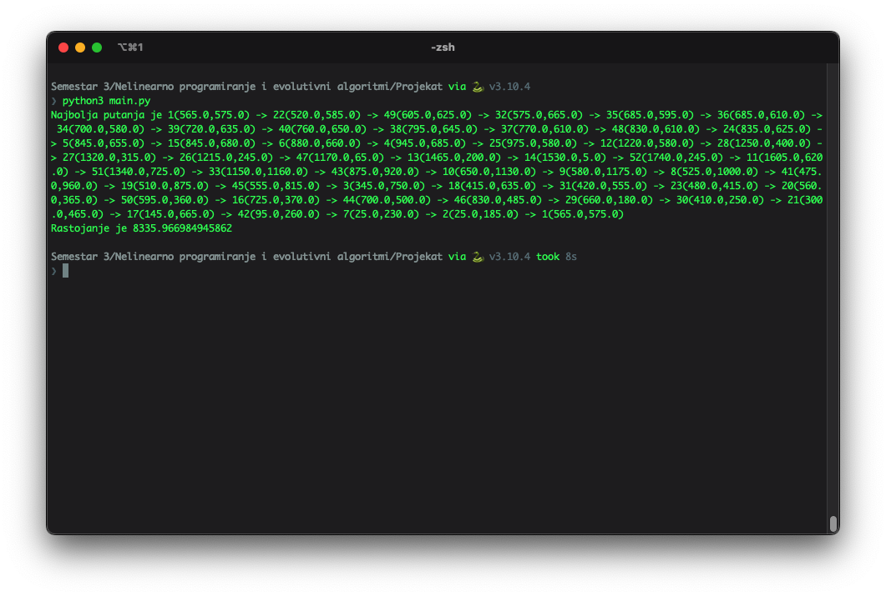

# Traveling Salesman Problem Solver

## Problem Description
The Traveling Salesman Problem (TSP) involves finding the shortest possible route that visits every city exactly once and returns to the starting city. Each city is defined by two coordinates, \(x\) and \(y\), and the distance between cities is calculated using the Euclidean distance formula.

## Introduction
To solve the TSP, we represent cities and distances as a weighted undirected graph. While graph theory algorithms could solve the problem, their performance degrades exponentially with the number of cities. Thus, we employ the Ant Colony Optimization Algorithm (ACO), simulating ants natural behavior to find food.

## Implementation
Cities data are stored in a text file, each with a unique number, \(x\) coordinate, and \(y\) coordinate. We use the Grad class to encapsulate city attributes. The ACO algorithm's parameters include the number of iterations, evaporation rate, number of ants, exploration factor (\(\alpha\)), and exploitation factor (\(\beta\)).

## Results
Algorithm effectiveness relies heavily on parameter values. After testing with various parameters, we determined optimal values for each. We set a time limit of 10 seconds for execution, determining that the number of iterations should not exceed 100, and the number of ants should not exceed 45 for optimal results.

## Enhancing Accuracy
For improved accuracy, the ratio of \(\alpha\) to \(\beta\) is crucial. We found a ratio of 1:12 optimal, favoring exploration in the algorithm's initial stages. Adjusting the pheromone evaporation rate impacts the solution minimally, with a 10% rate being optimal.

## Conclusion
Utilizing the ACO algorithm effectively addresses the TSP with satisfactory results within an acceptable timeframe. While increasing the number of ants and iterations could enhance precision, it compromises execution time.

